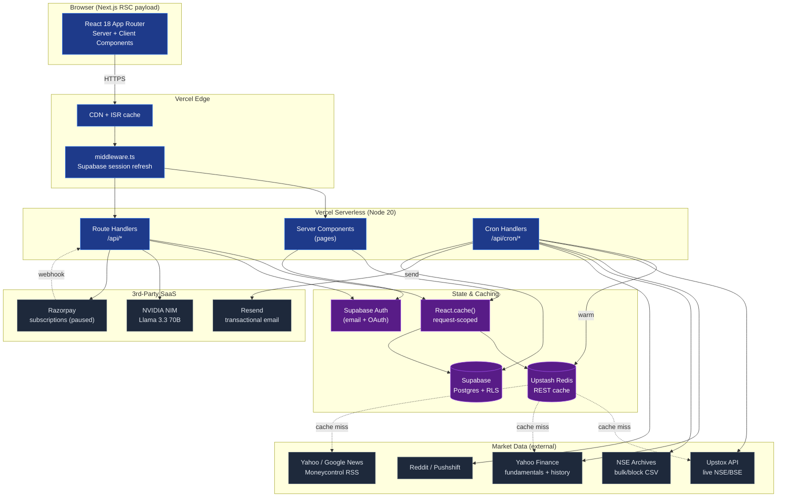
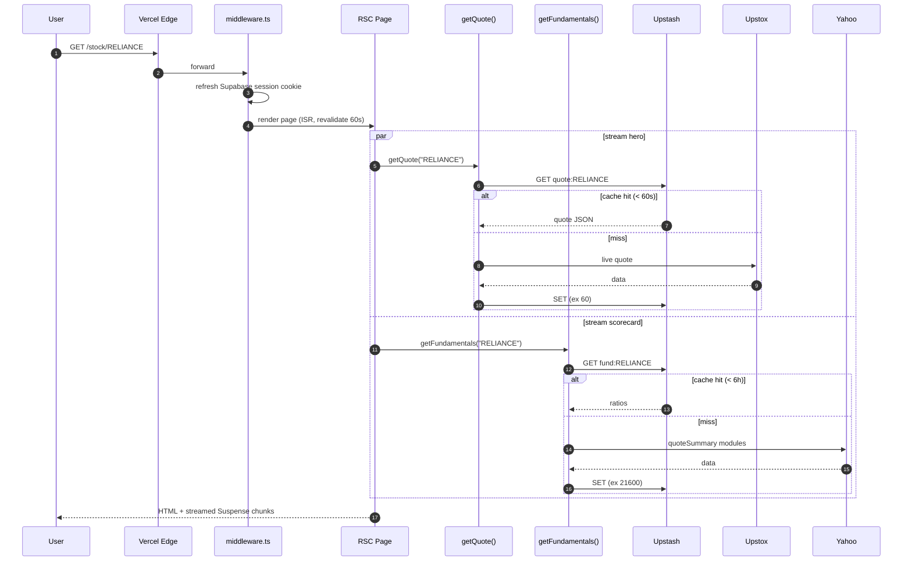
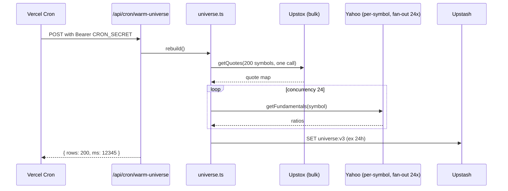
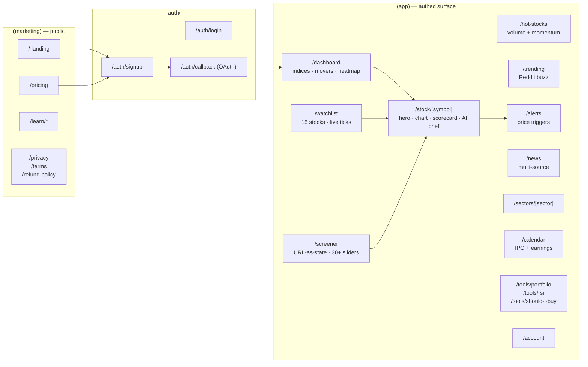
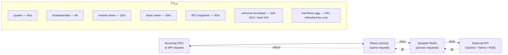

# Stockaar — High-Level Architecture

> Solo-operable subscription SaaS for Indian stock intelligence. Built on managed services so one engineer can ship, run, and scale it without ops overhead.

---

## 1. System at a Glance



---

## 2. Request Lifecycles

### 2a. User loads `/stock/RELIANCE`



### 2b. Cron: rebuild the universe (every 8 min, market hours)



---

## 3. Domain Map



---

## 4. Storage Schema (Supabase Postgres)

| Table | Owner | Purpose | RLS |
| --- | --- | --- | --- |
| `profiles` | user_id | plan, subscription state, Razorpay IDs | self read/update |
| `watchlist_items` | user_id | symbol + exchange tracked by user | self CRUD, unique `(user_id, symbol, exchange)` |
| `alerts` | user_id | price targets + condition (`above` / `below`) | self CRUD; status: `active` / `triggered` / `cancelled` |
| `alert_history` | user_id (via alert) | audit trail when alert fires | self read |
| `newsletter_subscribers` | email | public signup w/ unsubscribe token | service-role write, anon insert |
| `ipo_snapshot` | — | single-row JSONB snapshot of upcoming IPOs | service-role only |

All migrations live in `supabase/migrations/`. RLS is the only authz layer — service role is **never** used in user-facing routes (only cron, webhooks, admin).

---

## 5. Caching Topology



**Key invariant:** every external call is wrapped in a Redis-cached helper, and every helper is wrapped in `React.cache()`. This collapses N concurrent RSC reads of the same symbol within one request into a single network call — and amortises the cost across requests via Redis. Cron jobs keep Redis warm so user traffic almost always hits cache.

---

## 6. Cron Calendar (vercel.json)

| Cron | Schedule (UTC) | IST window | What it does |
| --- | --- | --- | --- |
| `warm-universe` | `*/8 3-11 * * 1-5` | 08:30–17:00 weekdays | Full rebuild of 200 symbols → Redis |
| `check-alerts` | `*/5 4-10 * * 1-5` | 09:30–16:00 weekdays | Fan-out quote check, fire emails on hit |
| `daily-brief` | `30 3 * * 1-5` | 09:00 weekdays | Build newsletter HTML, send via Resend |
| `inst-flows` | `37 13 * * 1-5` | 19:07 weekdays | Pull NSE bulk + block CSV → classify → agg |
| `reddit-buzz` | `*/14 * * * *` | always | Score Reddit + news mentions per symbol |

Every cron handler verifies `Authorization: Bearer ${CRON_SECRET}` — Vercel injects this automatically.

---

## 7. Eraser.io DSL (paste-ready)

Paste this into [eraser.io](https://app.eraser.io) for a polished rendered version of the system diagram:

```
title Stockaar — System Architecture

Client [icon: browser, color: blue] {
  Next.js App Router [icon: nextjs]
}

Vercel Edge [icon: vercel] {
  CDN + ISR [icon: cloudflare]
  Middleware [icon: shield]
}

Vercel Serverless [icon: aws-lambda, color: black] {
  RSC Pages [icon: react]
  API Routes [icon: api]
  Cron Handlers [icon: clock]
}

Caching [color: purple] {
  React cache [icon: react]
  Upstash Redis [icon: redis]
}

Persistence [color: green] {
  Supabase Postgres [icon: postgres]
  Supabase Auth [icon: lock]
}

Market Data [color: orange] {
  Upstox [icon: trending-up]
  Yahoo Finance [icon: yahoo]
  NSE Archives [icon: file-text]
  News + Reddit [icon: rss]
}

SaaS [color: gray] {
  Resend [icon: mail]
  Razorpay [icon: credit-card]
  NVIDIA NIM [icon: cpu]
}

Client > Vercel Edge: HTTPS
Vercel Edge > Vercel Serverless
Vercel Serverless > Caching: read-through
Caching > Market Data: cache miss
Vercel Serverless > Persistence: auth + user data
Cron Handlers > Market Data: warm cache
Cron Handlers > Resend: alerts + newsletter
Cron Handlers > Persistence: write snapshots
API Routes > NVIDIA NIM: AI brief
API Routes <> Razorpay: subscribe / webhook
```

---

## 8. Current Design Themes (what we picked and why)

| Theme | Choice | Reasoning |
| --- | --- | --- |
| **Hosting** | Vercel (serverless + cron + edge) | Zero ops, generous free tier, native Next.js, built-in cron — one engineer can run prod indefinitely. |
| **Rendering** | Server Components + streaming Suspense | Hero + chart paint immediately; heavy sections (AI brief, financials) stream in. No client-side data layer to maintain. |
| **State** | URL-as-state (screener), DB-as-state (watchlist/alerts), no Redux | Filters are shareable, back/forward works, no client store to debug. |
| **Data fanout** | Bulk Upstox for quotes (1 call/200 symbols); per-symbol Yahoo for fundamentals (concurrency-capped 24) | Quotes are hot path → bulk. Fundamentals change slowly → cache aggressively (6h). |
| **Caching** | Two-tier: `React.cache()` (per request) + Upstash Redis (cross request); cron pre-warms | User-facing latency stays tight even when external APIs are slow. Same symbol read 5x in one render = 1 fetch. |
| **Failover** | Upstox → Yahoo automatic on 401 (daily token expiry) | Upstox token expires ~3:30 AM IST; Yahoo's 15-min delayed feed keeps the app usable without manual intervention. |
| **Auth** | Supabase Auth (email/password + Google OAuth) gated by RLS | RLS is the authz model — no app-layer policy code, no chance of accidentally returning another user's row. |
| **Payments** | Razorpay subscriptions (currently paused) | India-first: UPI / cards / netbanking / GST invoicing built in. Currently 503-stubbed while we run free-for-all. |
| **AI** | NVIDIA NIM (Llama 3.3 70B free tier) for AI brief; Anthropic later for premium | Free tier first to validate demand without burning ₹. |
| **UI system** | Tailwind + design tokens; reusable `surface` / `chip` / `btn-brand` / `mesh-hero` primitives; CSS-only animation library (`FlashNumber`, `CountUp`, `Stagger`, `PageTransition`) | No framer-motion → bundle stays under 90 KB shared JS. Dense data still feels alive (prices flash, pages slide in). |
| **Accessibility** | Global `:focus-visible` ring + `prefers-reduced-motion` overrides on every keyframe | Tab navigation works everywhere; motion-sensitive users get instant transitions. |

---

## 9. Future Room for Improvement

### Tier 1 — within the next month (cheap wins)

1. **Sentry + Vercel Analytics wiring.** No prod error visibility today; one wrong Yahoo response shape can blank a section silently.
2. **OpenGraph image generator** (`@vercel/og`) per `/stock/[symbol]` so shared links show price + sparkline. Free organic distribution.
3. **`generateStaticParams` extension** beyond the top 100 — pre-render the full 200 NSE symbols (build adds ~30s, pays back at runtime).
4. **Stale-while-revalidate on more libs** — `news.ts`, `reddit-buzz.ts`, `ipo-calendar.ts` currently invalidate hard on TTL expiry. Returning stale-on-miss while triggering a background refresh would eliminate user-visible spinners.
5. **Index `(user_id, symbol, exchange)`** on `watchlist_items` — currently only the unique constraint exists, the API does a count + lookup; a composite index makes both O(log n).

### Tier 2 — 1–3 months (unlocks product)

6. **WebSocket tick stream** instead of polling. Upstox supports a market-data socket — replace per-page polling with one socket per session, push to RSC via Server-Sent Events. Cuts request volume 10×.
7. **Per-user cost telemetry.** Track Upstox calls, Yahoo calls, NIM tokens per `user_id` → real margin math before Razorpay re-enables.
8. **Race-safe alerts.** Current cron polls every 5 min, so a fast spike between polls is missed. Move to a Redis-backed "last-seen price" model + 1-min poll + interval comparison.
9. **Materialised views for screener.** Universe is recomputed on every cron tick; instead store derived columns (`composite_score`, `range_position`, `inst_net_30d`) on a flat table → the screener becomes a single indexed Postgres query and the 170 KB envelope round-trip disappears.
10. **Search infra.** Symbol search is a client-side linear scan over `NSE_SYMBOLS`. Move to Postgres trigram index + `/api/stocks/search` autocomplete with type-ahead.

### Tier 3 — strategic / pre-scale

11. **Pluggable data provider abstraction.** Today `getQuote()` knows about Upstox + Yahoo. Wrap in a `QuoteProvider` interface so Kite Connect, Zerodha, or Fyers can be swapped without touching the cache layer or routes.
12. **Background job system.** Vercel cron is fine for ≤5 jobs; once we add per-user smart alerts, broker reconciliation, or batch AI brief regeneration, move to **Inngest** or **Trigger.dev** for retries, fan-out, observability.
13. **Multi-region read replicas.** Supabase + Upstash both single-region right now. At 10K MAU India, add Mumbai region for both.
14. **Mobile app (React Native).** Re-use Supabase + the same API surface; the existing Server Components / RSC pages are not reusable, but the route handlers under `/api/*` are the right shape for a mobile client.
15. **SEBI compliance posture.** Today the disclaimer is the only legal surface. Pre-launch of Stock Calls / AI Brief at scale, gate behind a one-time "I understand" modal and add Research Analyst registration banner. (User has accepted the risk for now.)

### Tier 4 — what we deliberately did *not* do

- **No framer-motion / GSAP** — bundle discipline. CSS keyframes + 4 tiny client primitives cover 95% of the perceived polish.
- **No Redux / Zustand / TanStack Query** — RSC + URL state make a client cache redundant. Adding one would split the source of truth.
- **No tRPC** — route handlers + `fetch` from RSC is simpler and lets us cache at the HTTP layer.
- **No microservices** — one Next.js app, one Postgres, one Redis. Splitting before there's a scaling reason is pure cost.

---

## 10. Where to find things

| Looking for | Path |
| --- | --- |
| 6-week build plan | `C:\Users\tatha\.claude\plans\fluttering-discovering-sunbeam.md` |
| Conventions / coding rules | `docs/CONVENTIONS.md` |
| What's built (changelog) | `docs/PROGRESS.md` |
| Full feature catalogue | `docs/FEATURES.md` |
| DB migrations | `supabase/migrations/` |
| Cron schedules | `vercel.json` |
| Animation primitives | `components/anim/` |
| Design tokens | `app/globals.css` |
